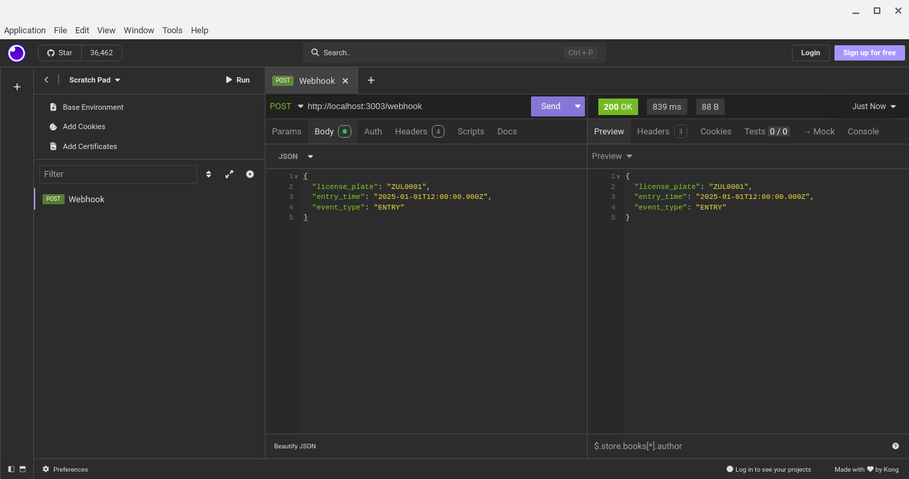
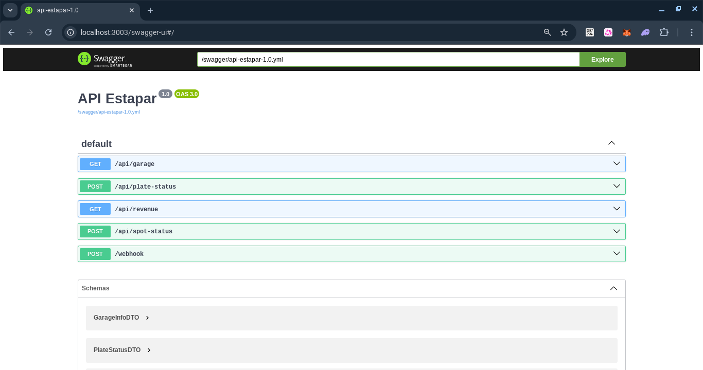

# Teste Desenvolvedor Java/Kotlin Backend

Este é o teste para Desevolvedor Java/Kotlin da Estapar.

O objetivo é criar um sistema de gestão de estacionamentos, que controla o número de vagas em aberto, entrada, saida e faturamento do setor.

## Requisitos Técnicos

* Kotlin 1.9.10
* Java JDK 21
* Gradle 4.4.1
* PostgreSql 16
* Docker 28.0.1

## Tecnologias Utilizadas

* Framework Micronaut
* Kotlin
* Gradle
* PostgreSql
* Swagger-UI
* Docker Compose

## Instalação 

```
git clone https://github.com/danilomeneghel/prova-estapar.git

cd prova-estapar
```

## Docker

Para rodar o projeto via Docker, bastar executar o seguinte comando:

```
docker compose up
```

Aguarde baixar as dependências e carregar todo o projeto, esse processo é demorado.
Caso conclua e não rode pela primeira vez, tente novamente executando o mesmo comando.

Para encerrar tudo digite:

```
docker compose down
```

## Gradle

Caso não tenho o Docker instalado e queira rodar diretamente a aplicação, altere o arquivo application.xml com o Host e Credenciais do banco de dados PostgreSql que irá conectar.

Após feito isso, execute o seguinte comando no terminal:

```
./gradlew clear run
```

## Testes

Para realizar os testes, execute o seguinte comando no terminal:

```
./gradlew test
```

## Simulador

Vamos prover um docker com o simulador, ele sobe e após 2 segundos começa e enviar eventos de entradas e saidas 
de veículos da garagem.
Vamos modificar os parametros no nosso teste para avaliar como a sua aplicação se comporta. 

O Simulador pode ser rodado com:

```
 docker run -d --network="host" cfontes0estapar/garage-sim:1.0.0

```

## Requisitos Funcionais

O sistema deve importar os dados geolocalizados de vagas e setores e armazenar em um banco de dados as informações.
Vagas podem ter metadados associados como preço, datas, horário de funcionamento e duração da estádia.

Crie um sistema que gerência o uso e faturamento deste setor de estacionamento, não precisamos de UI por enquanto somente o backend e API REST, mas já será disponibilizada para uso na garagem piloto.

Os dados da garagem são obtidos pelo endpoint de ```/garage``` e deve estar apto a receber por webhook entradas e saidas dos veículos por JSON com a API descrita abaixo.

Uma garagem é composta por uma cancela automática, utilizadas para entrar e sair e sensores de presença nas vagas que analisam a presença ou ausência de um veículo na vaga.

Após uma chamada ao endpoint de dados ```/garage``` a garagem é aberta e o sistema é liberado para entrada e saída de veículos, veja que podemos ter mais de uma cancela automática no mesmo estacionamento ou por setor.

Mesmo para sensores de solo que podem ser acionados em conjunto se varios carros estacionarem ao mesmo tempo.

## Regras de negócio

### Regra de preço dinâmico.
1. Com lotação menor que 25%, desconto de 10% no preço.
2. Com lotação menor até 50%, desconto de 0% no preço.
3. Com lotação menor até 75%, aumentar o preço em 10%.
4. Com lotação menor até 100%, aumentar o preço em 25%.

### Regra de lotação
Com 100% de lotação fechar o setor e só permitir mais carros com a saida de um já estacionado.

# API 

## Simulator Webhook API
Sua app deve aceitar conexões pelo url http://localhost:3003/webhook

### Entrada na garagem

**WEBHOOK - POST**
```JSON
{
  "license_plate": "ZUL0001",
  "entry_time": "2025-01-01T12:00:00.000Z",
  "event_type": "ENTRY"
}
```

------------------

### Entrada na vaga

**WEBHOOK - POST**
```JSON
{
  "license_plate": "ZUL0001",
  "lat": -23.561684,
  "lng": -46.655981,
  "event_type": "PARKED"
}
```

------------------

### Saida de garagem

**WEBHOOK - POST**
```JSON
{		
  "license_plate": "ZUL0001",
  "exit_time": "2025-01-01T12:00:00.000Z",
  "event_type": "EXIT"
}
```

## Simulator REST API

### Garage config

**GET**
`/garage`

```JSON
{
  "garage": [
    {
      "sector": "A",
      "basePrice": 10.0,
      "max_capacity": 100,
      "open_hour": "08:00",
      "close_hour": "22:00",
      "duration_limit_minutes": 240
    },
    {
      "sector": "B",
      "basePrice": 4.0,
      "max_capacity": 72,
      "open_hour": "05:00",
      "close_hour": "18:00",
      "duration_limit_minutes": 120
    }
  ],
  "spots": [
    {
      "id": 1,
      "sector": "A",
      "lat": -23.561684,
      "lng": -46.655981
    },
    {
      "id": 2,
      "sector": "B",
      "lat": -23.561674,
      "lng": -46.655971
    }
  ]
}
```

# API do Projeto a ser implementada

## REST API

### Consulta de Placa

**POST**
`/plate-status`
```JSON
{
  "license_plate": "ZUL0001"
}
```

Response
```JSON
{
  "license_plate": "ZUL0001",
  "price_until_now": 0.00,
  "entry_time": "2025-01-01T12:00:00.000Z", 
  "time_parked": "2025-01-01T12:00:00.000Z",
  "lat": -23.561684,
  "lng": -46.655981
}
```

------------------

### Consulta de Vaga

**POST**
`/spot-status`

Request
```JSON
{
  "lat": -23.561684,
  "lng": -46.655981
}
```

Response - 200
```JSON
{
  "ocupied": false,
  "license_plate": "",
  "price_until_now": 0.00,
  "entry_time": "2025-01-01T12:00:00.000Z",
  "time_parked": "2025-01-01T12:00:00.000Z"
}
```

### Consulta faturamento

**POST**
`/revenue`

Request
```JSON
{
  "date": "2025-01-01",
  "sector": "A"
}
```

Response
```JSON
{
  "amount": 0.00,
  "currency": "BRL",
  "timestamp": "2025-01-01T12:00:00.000Z"
}
```

## Swagger

Documentação da API RESTful:<br>

http://localhost:3003/swagger-ui


## Screenshots

WebHook <br>
 <br><br>

Swagger-UI <br>
 <br><br>

Modelagem ER <br>
 <br><br>

Testes Unitários <br>
 <br><br>

Aplicação Micronaut <br>
 <br><br>


## Licença

Projeto licenciado sob <a href="LICENSE">The MIT License (MIT)</a>.<br><br>


Desenvolvido por<br>
Danilo Meneghel<br>
danilo.meneghel@gmail.com<br>
http://danilomeneghel.github.io/<br>
